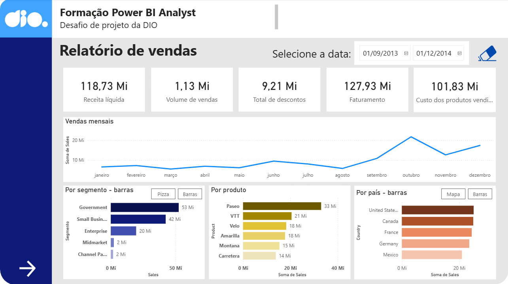

# dashboard-financeiro-powerbi
Projeto de Business Intelligence desenvolvido em Power BI para análise de desempenho comercial. O dashboard permite visualizar vendas e lucro por produto, país, segmento de clientes e período, auxiliando na identificação de padrões e insights estratégicos.

# Relatório de Lucros - Dashboard Power BI

## Descrição do Projeto

Este projeto foi desenvolvido como parte do desafio da formação Power BI Analyst da DIO.

O objetivo foi construir um dashboard interativo para análise de lucros, permitindo identificar padrões de desempenho comercial a partir de diferentes dimensões de análise.

O relatório permite explorar os dados por:

- Período
- País
- Produto
- Segmento de mercado
- Trimestre

---

## Arquivos

- **README**
  Documentação do projeto, descrição, estrutura do relatório e principais insights
- **Dashboard-financeiro-BI.pbix**
  Arquivo do Power BI contendo o dashboard interativo desenvolvido para análise de desempenho comercial.
- **Dashboard-financeiro-BI.png**
  Devido às limitações de publicação do Power BI Service para contas pessoais, uma prévia do dashboard pode ser visualizado através deste arquivo .png.

---

## Estrutura do Dashboard

O dashboard foi organizado para apresentar diferentes perspectivas do lucro obtido pela empresa.
As visualizações incluem:

- Receita líquida e bruta, volume de vendas, descontos e custos
- Receita líquida por segmento
- Receita líquida por produto
- Receita líquida por país
- Lucro por segmento
- Lucro por produto
- Lucro por país
- Lucro por trimestre

Além disso, foram implementados filtros que permitem selecionar períodos específicos para análise.

---

## Prévia do Dashboard

---

## Principais Insights

A análise dos dados permitiu identificar alguns pontos importantes:

- O produto **Paseo** apresenta o maior volume de vendas e lucro entre os produtos analisados. O lucro obtido com este produto é **60% superior** que o segundo produto com maior lucro (**VTT**)
- O segmento **Government** é responsável pela maior parcela de vendas e lucro. O lucro obtido com o setor público representa **67% do lucro total** entre o período do dataset
- Países como **França, Canadá e Alemanha** apresentam maior contribuição para o resultado financeiro.

- O **quarto trimestre** apresenta o maior desempenho ao longo dos anos. No entanto, é importante considerar que os dados do quarto trimestre de **2013 possuem três meses completos**, enquanto o quarto trimestre de **2014 possui apenas dois meses registrados**, devido à ausência de dados de dezembro.
- Mesmo com essa diferença de período, o **lucro do quarto trimestre de 2014 foi aproximadamente 42% superior ao do quarto trimestre de 2013**, o que pode indicar um crescimento significativo no desempenho. Ainda assim, essa comparação deve ser interpretada com cautela, uma vez que a ausência de dados completos pode influenciar a análise.

---

## Autor
Priscila Oliveira
